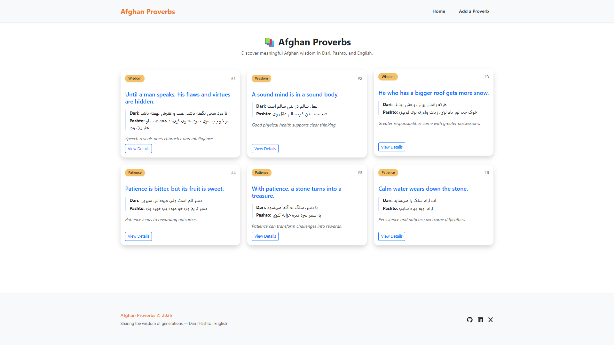
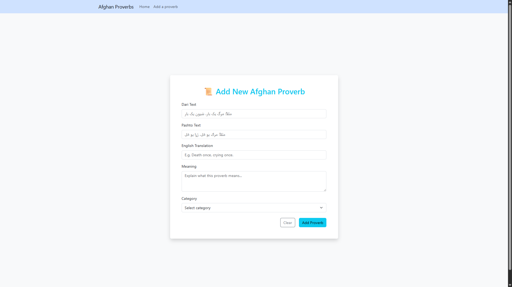
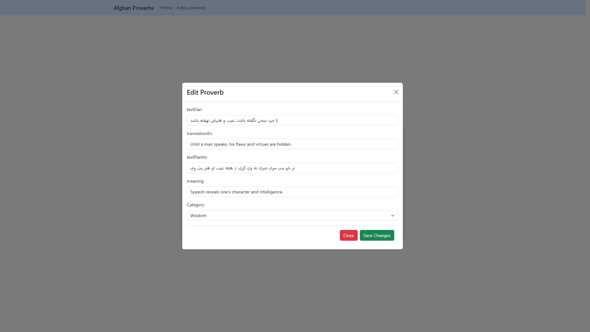
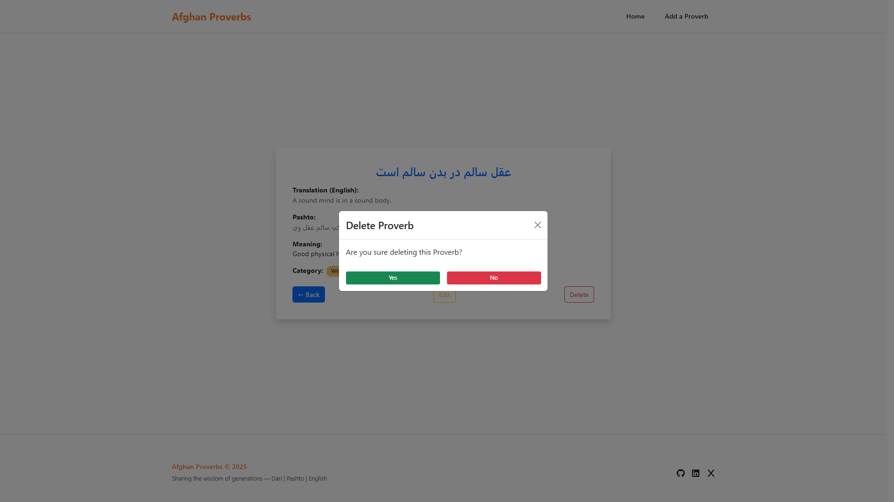
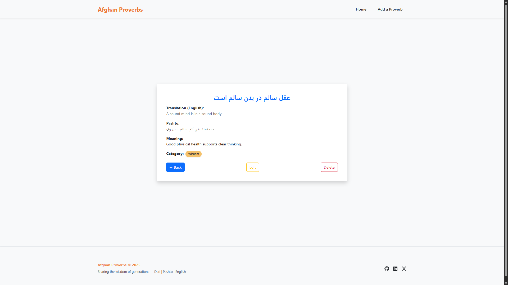
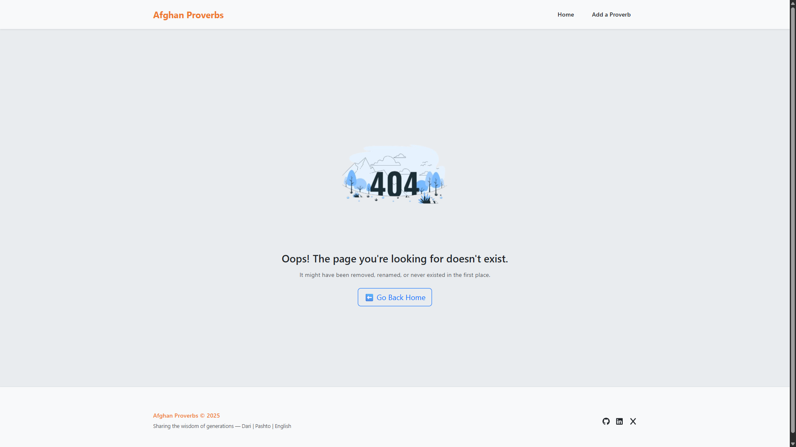

# Afghan Proverbs & Sayings – Frontend Application

A frontend web application for managing and exploring traditional Afghan proverbs in Dari, Pashto, and English. This application connects to a RESTful API and allows users to **view**, **add**, and **read full details** of proverbs. Built using React, it features a responsive design, loading indicators, and intuitive navigation.

---

## 🌐 Live Backend API

This app connects to a deployed backend:

🔗 **[https://afghan-proverbs-api-kysw.onrender.com](https://afghan-proverbs-api-kysw.onrender.com)**

---

## 🚀 Features

### ✅ Implemented

1. **Homepage** (`/`)
   - Fetches and displays all proverbs via `GET /proverbs`
   - Each row includes:
     - `textDari`
     - `textPashto`
     - `translationEn`
     - `meaning`
     - `category`
     - A **View** button for detailed view

2. **View Single Proverb** (`/view-proverb/:id`)
   - Displays full details of a selected proverb via `GET /proverbs/:id`
   - Includes loading indicator while fetching

3. **Add Proverb** (`/add-proverb`)
   - Form for creating a new proverb using `POST /proverbs`
   - Includes fields: `textDari`, `textPashto`, `translationEn`, `meaning`, and `category`
   - Form validation and user feedback included

4. **Not Found Route**
   - A `NotFound.jsx` component handles any undefined route (`*`)

5. **Navigation Bar**
   - `NavbarSection.jsx` provides links to Home and Add Proverb

6. **Loading State**
   - A custom loading spinner (`CustomSpinner.jsx`) shows while data is being fetched

---


## 🛠️ Tech Stack

- **React** (with Vite)
- **React Router**
- **React Bootstrap** (for UI components)
- **Axios** (for HTTP requests)
- **React Toastify** (for alerts, toasts)
- **Bootstrap CSS**
- **JavaScript (ES6+)**

---

## 💻 Getting Started (Local Setup)

### 1. Clone the Repository

```bash
git clone https://github.com/kubra-Islami/afghan-proverbs-front.git
cd afghan-proverbs-front

```

### 2. Install Dependencies

```bash
npm install

```

### 3. Start the Development Server

```bash
npm run dev

```

### 4. Open in Browser

Go to: http://localhost:5173

---

## 🧩 Features to Implement

| Feature | Status |
|--------|--------|
| Filter proverbs by category (/proverbs?category=...) | ❌ Not yet implemented |
| Display a random proverb (/proverbs/random) | ❌ Not yet implemented |
| Search bar to filter proverbs by keyword | ❌ Not yet implemented |
| Display multiple categories per proverb (as tags) | ❌ Not yet implemented |

---
### 🛠 Tech Stack

- **React** (with Vite)
- **React Router**
- **React Bootstrap** (for UI components)
- **React Hook Form** (for form handling and validation)
- **Axios** (for HTTP requests)
- **React Toastify** (for alerts, toasts)
- **Bootstrap CSS**
- **JavaScript (ES6+)**


## 📸 Screenshots

### 🔹 Homepage



### 🔹 AddProverb



### 🔹 EditProverb


### 🔹 DeleteProverb


### 🔹 ProverbDetails


### 🔹 NotFound


## 📫 Author
### Kubra Islami
#### ⚙️Freelance Web Developer


